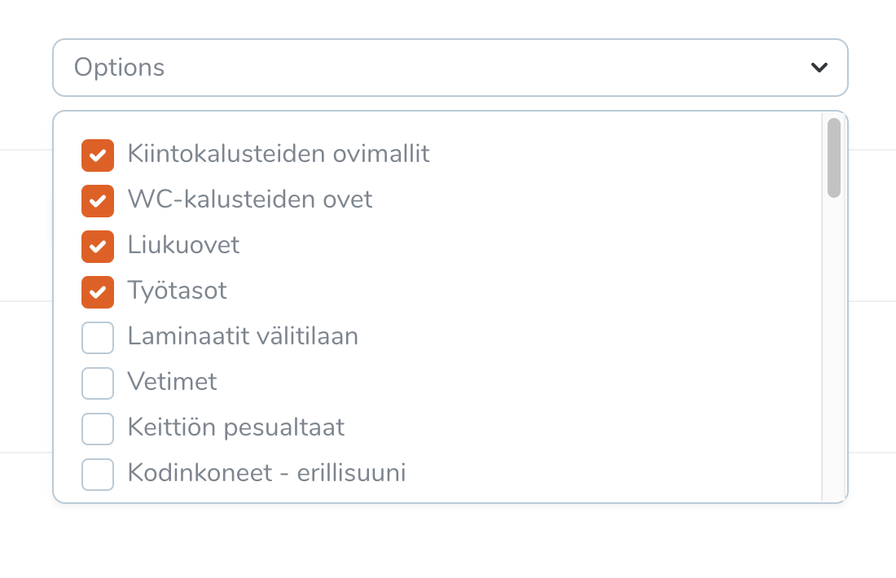

# Laravel Nova Multiselect Checkboxes Field (Dropdown)



## Installation

`composer require mohkoma/nova-multiselect-checkboxes`

## Usage

```php
use Nova\MultiselectCheckboxes\MultiselectCheckboxes;

MultiselectCheckboxes::make('Options', 'FIELD_NAME')
->options($this->{FIELD_NAME}->pluck('name', 'id'))
->placeholder('Options'),
```

## Configuration

Use the `options()` function to pass the options list, the function accept the options as first parameter (it must be an keyed array `$this->{FIELD_NAME}->pluck('name', 'id')`) and optionally the selections as a secound parameters (must be an array of ids).
Please note that if you don't pass the selections, the package will use the field default value ex: `FIELD_NAME` column in the exemple above.

```php
use Nova\MultiselectCheckboxes\MultiselectCheckboxes;

->options($this->{FIELD_NAME}->pluck('name', 'id'), [23, 34, 66, 76])
```

You able to set a placeholder for the field using `placeholder()` function.


Sometimes you might need to return the value of the unselected options, for that you can use `returnUnchecked()` function.


```php
use Nova\MultiselectCheckboxes\MultiselectCheckboxes;

MultiselectCheckboxes::make('Options', 'FIELD_NAME')
->options($this->{FIELD_NAME}->pluck('name', 'id'))
->placeholder('Options')
->returnUnchecked(),
```

## License

MIT